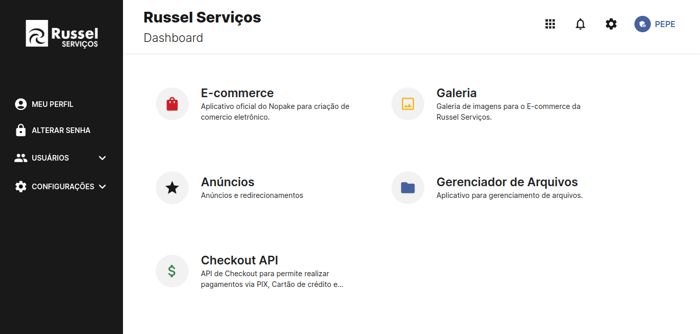

# Painel Russel Serviços

## Rodando o projeto

- Crie um arquivo .env seguindo o exemplo do arquivo ".env.example"

  ```
    npm install
    npx prisma generate
    npm run dev

  ```

- Navegue até `http://localhost:3000`

## Para gerar o build

`npm run build`

## Para gerar o build estático

`npm run export`

## Tecnologias principais

- Next - [Docs](https://nextjs.org/docs)
- Material UI - [Docs](https://mui.com/material-ui/getting-started/overview/)


